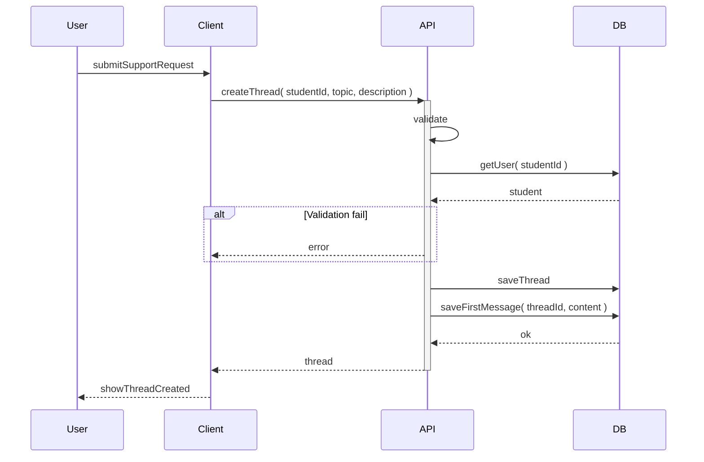

# Create thread

Student starts a new support request by entering a topic and the first message. The system creates the thread and saves that text as the first message so the counsellor can see it.

## Flow

| Step | What happens |
|------|----------------|
| 1 | User fills in topic and first message, then submits. |
| 2 | System checks the user is a student and the inputs are valid. |
| 3 | A new thread is created and the first message is saved. |
| 4 | User sees the new thread and can open it to continue the conversation. |
