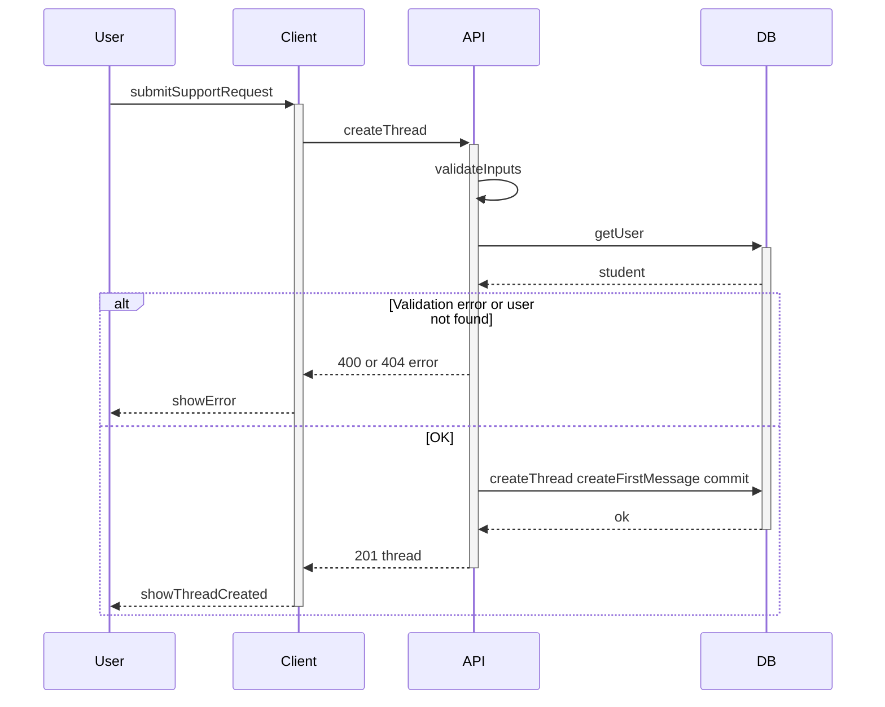

# Create thread

Student starts a new support request by entering a topic and the first message. The system creates the thread and saves that text as the first message so the counsellor can see it.

## Flow

| Step | What happens |
|------|----------------|
| 1 | User submits topic and the first message. |
| 2 | API validates inputs and confirms the user exists and is a student (otherwise returns 400/404). |
| 3 | API creates the thread and saves the first message, then returns 201 with the created thread. |
| 4 | Client shows the created thread screen. |
