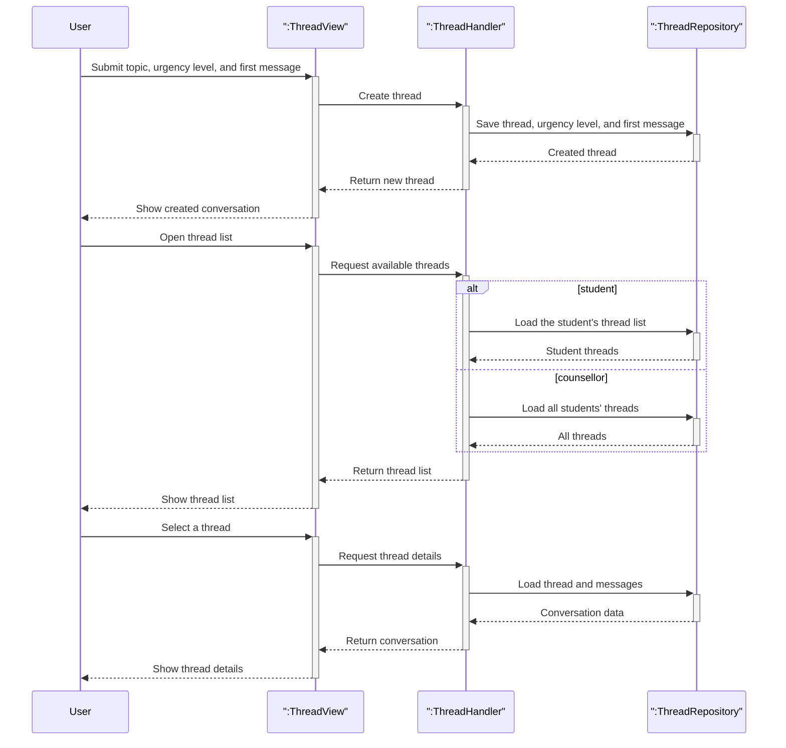

# Support thread lifecycle

This diagram combines the main thread management flows into one high-level view: starting a support request, browsing threads, and opening a conversation.

## Covered flows

| Flow | What it shows |
|------|----------------|
| Start a support request | A student creates a thread with a selected urgency level, and the first message is stored as part of the new conversation. |
| Browse threads | The system returns the relevant thread list for the current user view. |
| Open a conversation | The client loads the selected thread together with its message history. |
