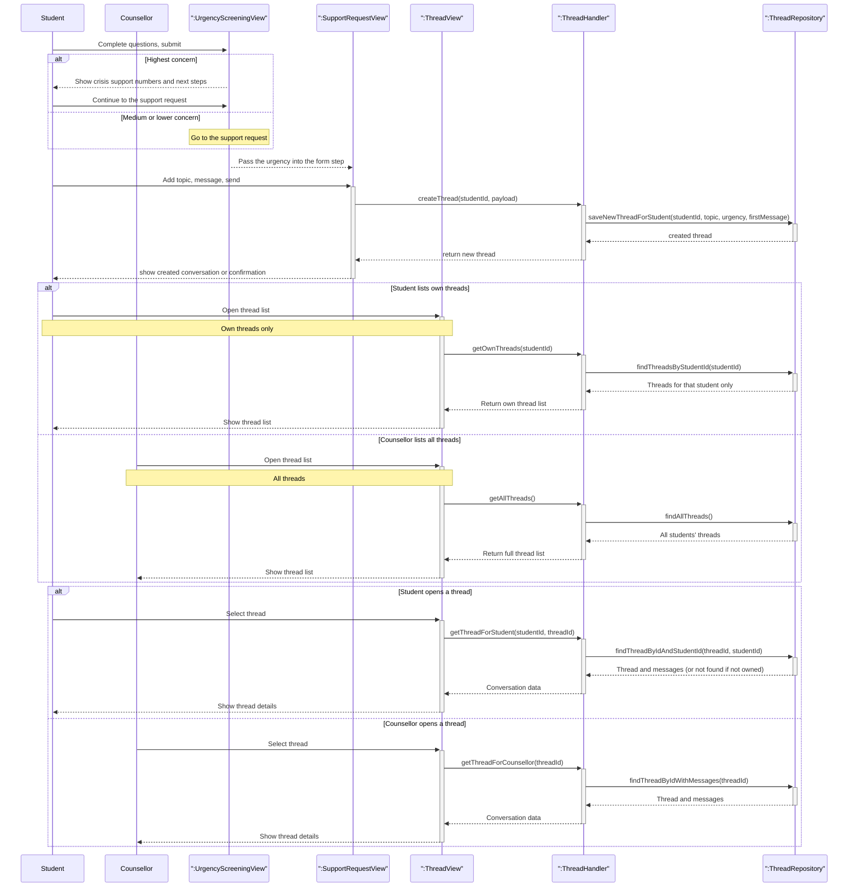

# Support thread lifecycle

The support thread lifecycle: a client-side urgency check-in precedes thread creation, where high urgency triggers crisis-style guidance before submission. The student then submits a topic and initial message, and the backend creates a thread with an associated urgency level. After creation, access is role-based: students may view and open only their own threads, while counsellors may access all threads.

## Covered flows

| Flow                     | What it shows                                                                                                                                                       |
| ------------------------ | ------------------------------------------------------------------------------------------------------------------------------------------------------------------- |
| Check-in and new request | A short check-in; optional crisis information at the **highest** level; then **createThread** / **saveNewThreadForStudent** with topic, urgency, and first message. |
| Browse threads           | **getOwnThreads** for a student; **getAllThreads** for a counsellor.                                                                                                |
| Open a conversation      | **getThreadForStudent** scopes by `studentId`; **getThreadForCounsellor** loads by thread id.                                                                       |
| Team visibility          | After a case exists, the team **sees urgency** in the list or chat when they work the app; **no** automatic text or email from the check-in flow.                   |
