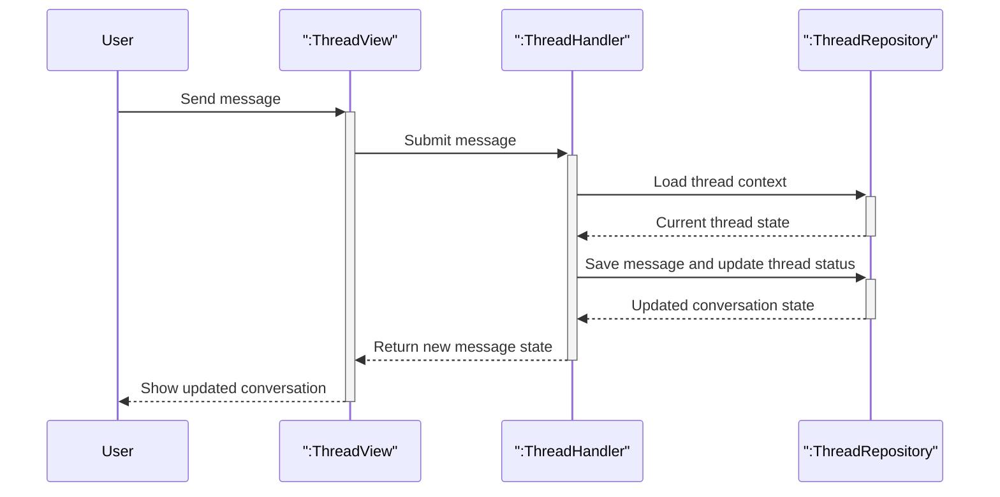

# Send messages in a thread

This diagram focuses on the messaging flow after a thread has been opened. It shows the conversation update at a high level without low-level validation or transport details.

## Covered flow

| Flow | What it shows |
|------|----------------|
| Exchange messages | A user sends a message in an existing thread, the conversation is updated, and the latest state is shown in the chat view. |
