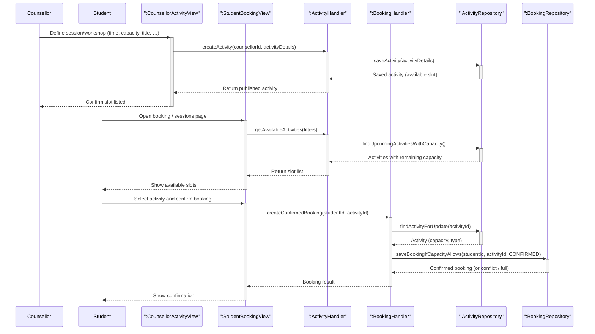

# Booking flow (counsellor-published activities / slots)

Counselling activities in the system represent bookable slots (e.g. sessions or workshops with capacity), and bookings link a student to an activity. This diagram focuses on the booking flow, showing how counsellors publish availability and how students discover and confirm bookings.

## Covered flows

| Step            | What it shows                                                                                                              |
| --------------- | -------------------------------------------------------------------------------------------------------------------------- |
| Publish slots   | **Counsellor** (or facilitator) creates an **activity**; **ActivityRepository** persists it as an available bookable slot. |
| Discover slots  | **Student** loads upcoming activities that still have **capacity**.                                                        |
| Confirm booking | **BookingHandler** validates capacity and persists a **CONFIRMED** row via **BookingRepository**.                          |
