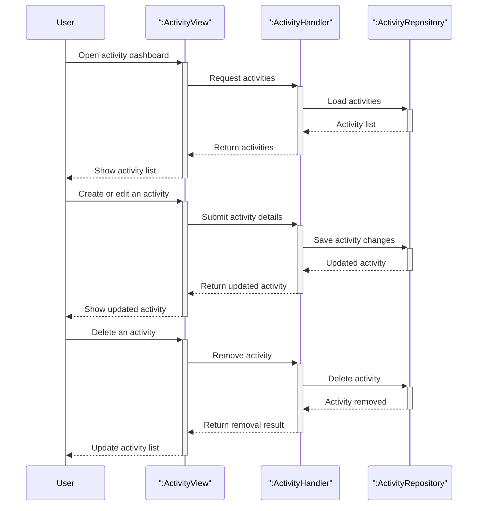

# Activity management lifecycle

This diagram combines the main activity management flows into one high-level view: browsing activities, creating or updating an activity, and removing an activity.

## Covered flows

| Flow | What it shows |
|------|----------------|
| Browse activities | The user opens the activity dashboard and reviews the current list of activities. |
| Create or update an activity | The user adds a new activity or edits an existing one, and the system saves the latest activity details. |
| Remove an activity | The user removes an activity and the dashboard reflects the updated list. |
