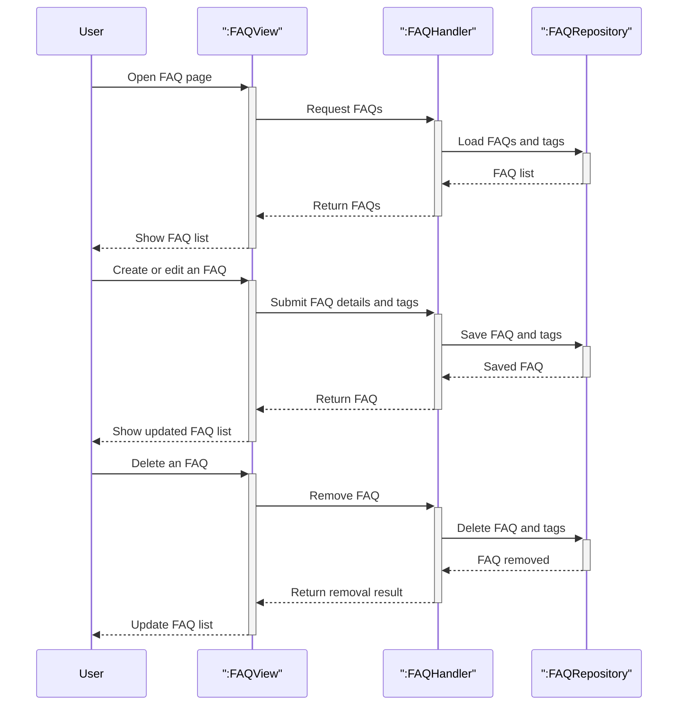

# FAQ lifecycle

This diagram combines the main FAQ flows into one high-level view: browsing FAQs, creating or updating an FAQ, and removing an FAQ.

## Covered flows

| Flow | What it shows |
|------|---------------|
| Browse FAQs | The user opens the FAQ page and reviews the list of FAQs with categories and tags. |
| Create or update an FAQ | The user adds a new FAQ or edits an existing one, and the system saves the question, answer, category, and tags. |
| Remove an FAQ | The user deletes an FAQ and the list reflects the change. |
