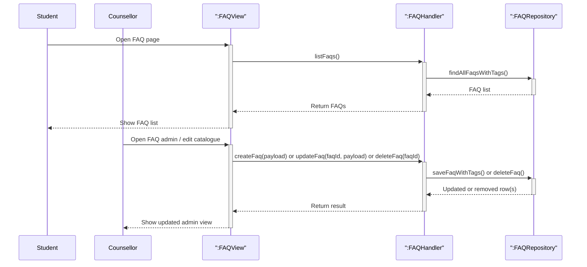

# FAQ access and catalogue maintenance

This diagram combines the main FAQ flows into one high-level view: browsing FAQs, creating or updating an FAQ, and removing an FAQ.

## Covered flows

| Flow               | What it shows                                                                             |
| ------------------ | ----------------------------------------------------------------------------------------- |
| Browse FAQs        | `GET /api/faqs` via **listFaqs** / **findAllFaqsWithTags**.                               |
| Maintain catalogue | **createFaq** / **updateFaq** / **deleteFaq** → `POST` / `PUT` / `DELETE` on `/api/faqs`. |

