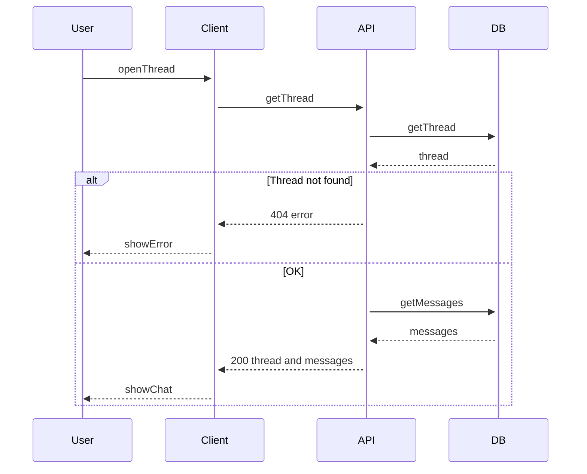

# Get thread detail

User opens a thread to see the full conversation. The screen shows the thread and all messages in order.

## Flow

| Step | What happens |
|------|----------------|
| 1 | User selects a thread from the list. |
| 2 | Client requests GET /api/threads/{thread_id}. If the thread does not exist, the API returns 404. |
| 3 | If found, the API loads all messages for that thread in chronological order and returns 200 with { thread, messages }. |
| 4 | Client renders the conversation view. |
