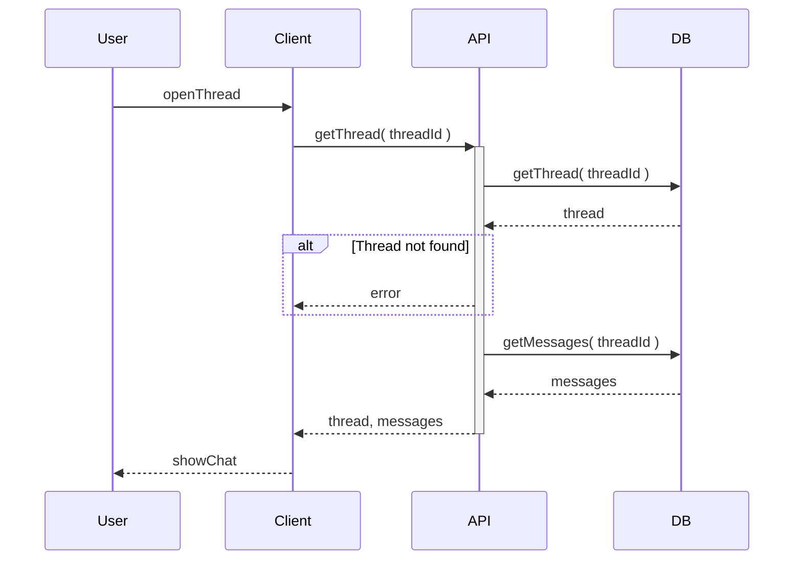

# Get thread detail

User opens a thread to see the full conversation. The screen shows the thread and all messages in order.

## Flow

| Step | What happens |
|------|----------------|
| 1 | User taps a thread in the list. |
| 2 | System loads the thread and its messages in order. |
| 3 | User sees the full conversation and can send a new message. |
