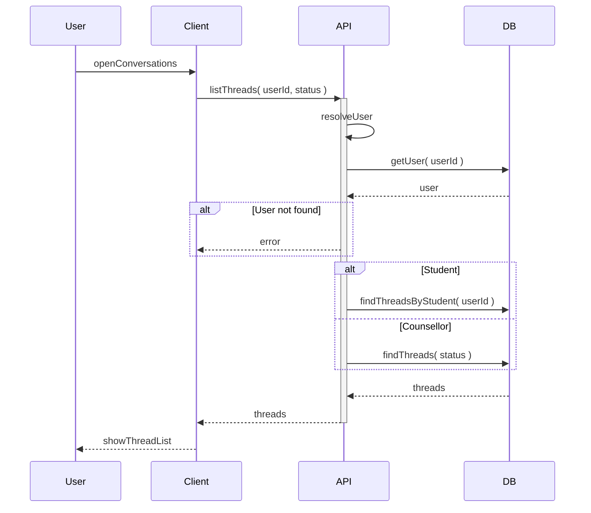

# List threads

User opens the conversations screen (student: my requests only; counsellor: all requests, with optional filter by status).

## Flow

| Step | What happens |
|------|----------------|
| 1 | User opens the list (students see their own requests; counsellors see the queue). |
| 2 | System loads the user and fetches the right threads. |
| 3 | List is shown, newest first; counsellors can filter by waiting or replied. |
