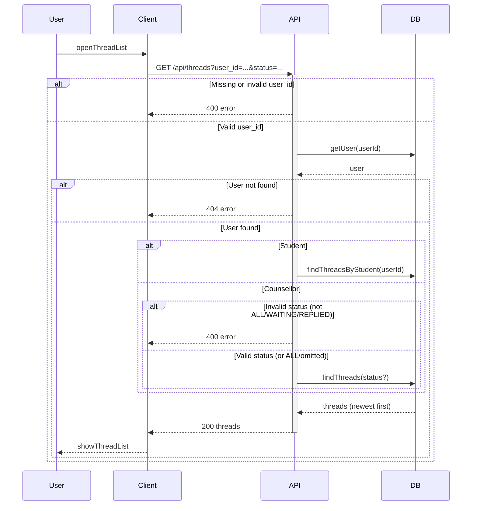

# List threads

User opens the conversations screen (student: my requests only; counsellor: all requests, with optional filter by status).

## Flow

| Step | What happens |
|------|----------------|
| 1 | User opens the conversations list screen. |
| 2 | Client requests GET /api/threads with user_id (and optional status). API validates user_id; if missing/invalid it returns 400. |
| 3 | API loads the user from the DB; if the user does not exist it returns 404. |
| 4 | If the user is a student, API fetches only that student’s threads. If the user is a counsellor, API optionally validates status; if invalid it returns 400, otherwise it fetches threads with an optional status filter. |
| 5 | API returns the threads sorted by newest first, and the client renders the thread list. |
