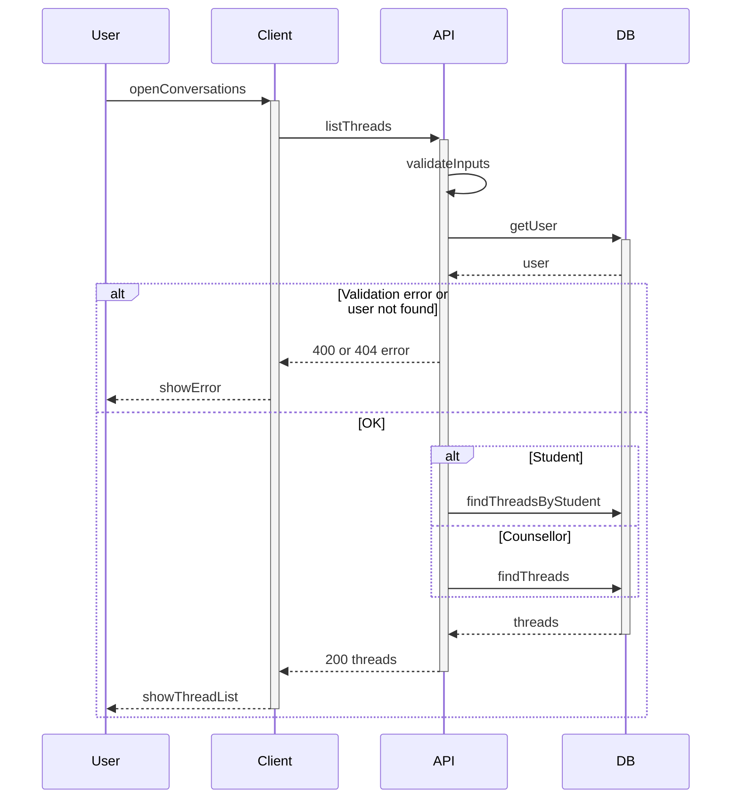

# List threads

User opens the conversations screen (student: my requests only; counsellor: all requests, with optional filter by status).

## Flow

| Step | What happens |
|------|----------------|
| 1 | User opens the conversations list screen. |
| 2 | API validates inputs and loads the user (otherwise returns 400/404). |
| 3 | API fetches threads based on role (student: own only; counsellor: all with optional status filter), sorted newest first. |
| 4 | Client displays the thread list. |
