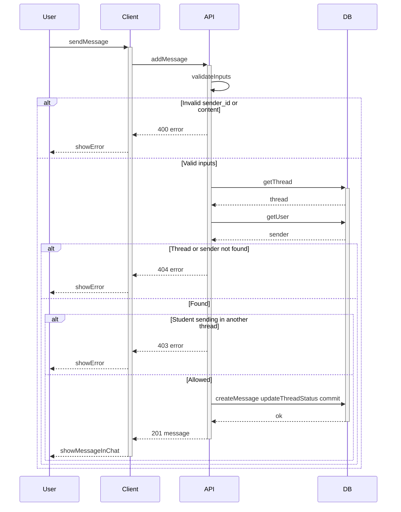

# Send message

User writes a message and sends it in the thread. Students can only send in their own threads; counsellors can reply in any thread. The thread status (e.g. waiting for reply) is updated accordingly.

## Flow

| Step | What happens |
|------|----------------|
| 1 | User submits a message in a thread. Client calls POST /api/threads/{thread_id}/messages with sender_id and content. |
| 2 | API validates inputs (missing/invalid sender_id or empty content returns 400). |
| 3 | API checks the thread and sender exist (missing thread or sender returns 404) and enforces permissions (student can only post in their own thread, otherwise 403). |
| 4 | If allowed, the API saves the message, updates the thread status (WAITING if the sender is a student, otherwise REPLIED), commits, and returns 201 with the created message. |
| 5 | Client renders the new message in the chat. |
