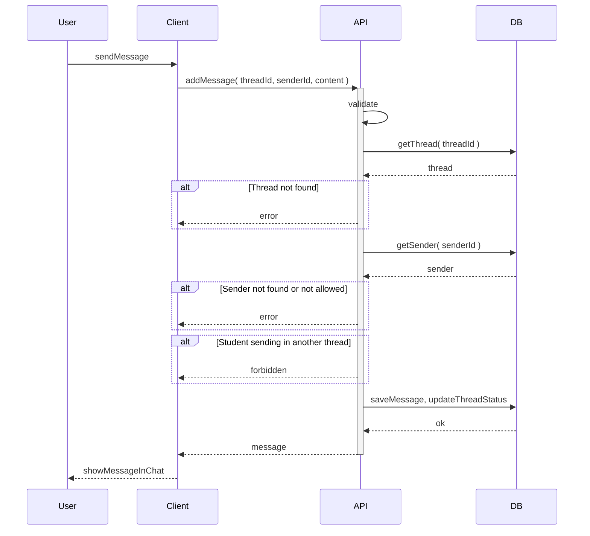

# Send message

User writes a message and sends it in the thread. Students can only send in their own threads; counsellors can reply in any thread. The thread status (e.g. waiting for reply) is updated accordingly.

## Flow

| Step | What happens |
|------|----------------|
| 1 | User types a message and sends. |
| 2 | System checks the thread exists and the sender can post (students only in their own thread). |
| 3 | The message is saved and the thread status is updated (e.g. waiting for counsellor reply). |
| 4 | The new message appears in the chat. |
